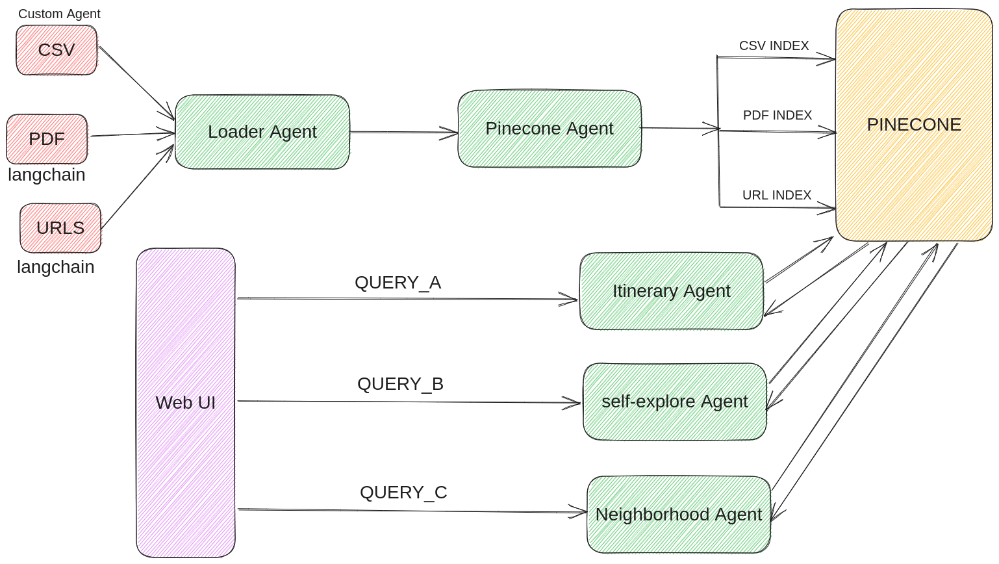

# Travel Agent
[](https://www.python.org/downloads/release/python-360/)




# 0- Installation

```
$ git clone https://github.com/AbdelrahmanAbounida/travel_agent.git
$ cd travel_agent
$ pip install -r requirements.txt
```

### .env
Create a .env file in travel_agent folder with .env.local fields 

# 1- Running

## client
```
$ streamlit run 1_Home.py
```
